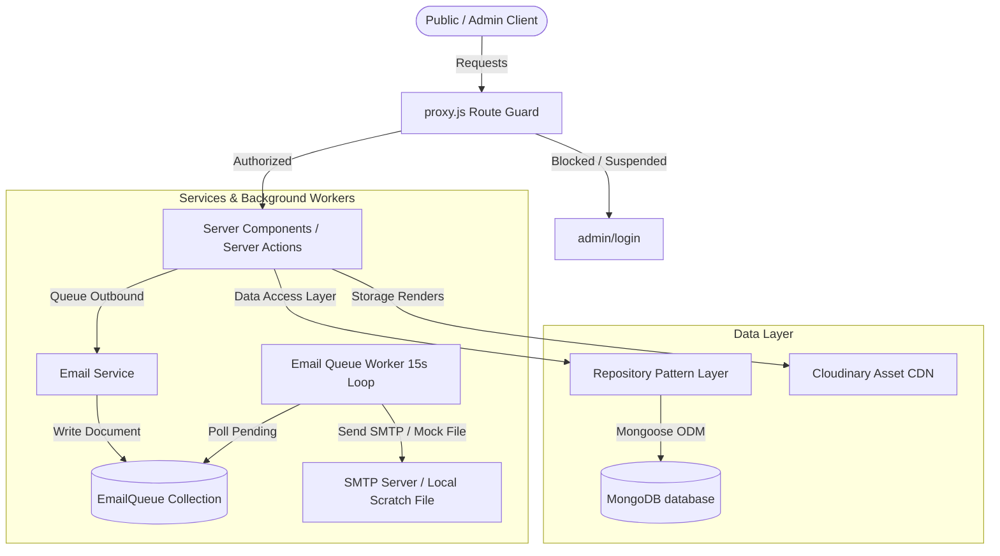
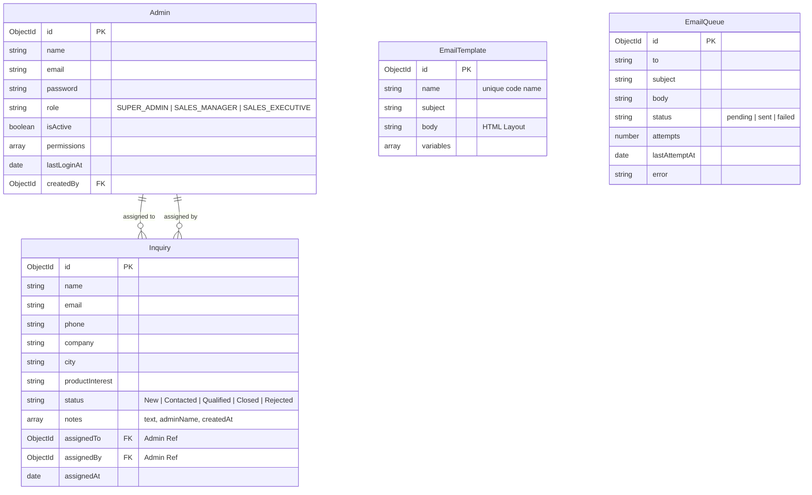

# Shivshakti Elevator Components - Enterprise CRM & Digital Showroom Portal

> **A High-Performance Enterprise Multi-Role CRM and Digital Showroom Portal Engineered for Shivshakti Elevator Components Pvt. Ltd. (Surat, Gujarat, India).**

Version: `2.0.0-stable` | Status: **Enterprise CRM Upgrade Completed** | License: **Proprietary / Commercial**

[](https://nextjs.org/)
[](https://react.dev/)
[](https://tailwindcss.com/)
[](https://www.mongodb.com/)
[](https://cloudinary.com/)

---

## 1. Overview & Business Problem

The **Shivshakti Elevator Components Web Application** is a full-stack enterprise B2B platform tailored for heavy-industry manufacturing commerce. The system features a public digital showroom with interactive cabin configurators, 360° virtual walkthroughs, and a secure administration dashboard (`/admin`).

The application has been upgraded to a **Multi-Role Enterprise CRM & Lead Pipeline Manager** to solve the following business challenges:
* **Unstructured Inquiries**: Quotation requests are structured automatically, qualifying B2B requirements (elevator types, parts, quantities).
* **Lead Tracking & Ownership**: Leads are assigned directly to active Sales Executives, restricting access to customer lists and ensuring high accountability.
* **Email Communication Lag**: A template-driven asynchronous queue worker delivers instant notifications to customers and staff without blocking requests.
* **Security & Audits**: System modifications are guarded by Role-Based Access Control (RBAC) and monitored via a searchable audit trail of actions.

---

## 2. Target Users & Roles

The system supports five administrative roles with precise boundaries:
1. **Super Admin**: Full ownership. Creates admins, overrides roles, reviews audit logs, manages catalogs, views CRM pipelines, and edits email templates.
2. **Sales Manager**: Pipeline ownership. Assigns leads, updates pipeline statuses, creates follow-up logs, and exports CSV lists.
3. **Sales Executive**: Direct sales. Can view, update, and add follow-up notes *only* to inquiries explicitly assigned to them. Forbidden from deletions or exports.
4. **Marketing Manager**: Outreach control. Accesses the newsletter subscriber lists, templates, and analytics. Forbidden from editing inquiries or products.
5. **Content Editor**: Catalog maintenance. Manages products, testimonials, gallery images, blogs, and SEO details. Restricted from CRM data.

---

## 3. Key Upgraded Features

### I. Multi-Role RBAC & Access Gates
* **Implementation**: Managed globally via `roles.js` and `permissions.js`.
* **Security Gates**: Enforced at the route proxy layer (`src/proxy.js`) and within server actions. Restricted operations (e.g. deletions, user creation) reject unauthorized API calls with an immediate 403 Access Denied check.

### II. Dynamic Lead Assignment & Pipelines
* **Implementation**: Mapped in `InquiriesClient.js` using drag-and-drop actions.
* **Ownership Scoping**: Super Admins and Sales Managers can view all leads and reassign them via dropdown selection cards. Sales Executives only see cards assigned to them.
* **Activity Logs**: Every lead assignment logs the timestamp, the assigning manager, and the target executive.

### III. Automated Template & Email Worker Queue
* **Implementation**: Configured as an in-memory queue processor (`email-worker.js`) running on a 15-second database loop.
* **Templates CMS**: Fully editable email layouts in `/admin/email-templates`.
* **Development Mode**: If SMTP parameters are missing, compiled HTML layouts are backed up automatically to `/scratch/emails/` for developer verification.

### IV. Real-Time Cabin Configurator & 360° Renders
* **Implementation**: Located at `/products/[slug]`. Customers configure colors and metal finishes in real time with smooth CSS transitions.
* **360° Variants**: The admin panel (`View360Uploader.js`) supports uploading specific 6-side cubemaps (front, back, left, right, ceiling, floor) per color+finish combo, falling back to base 360° assets if incomplete.

---

## 4. System Architecture



---

## 5. Project Directory Structure

```
shivshakti/
├── src/
│   ├── app/                      # Next.js App Router Page Routes
│   │   ├── admin/                # Administration Dashboards
│   │   │   ├── email-templates/  # Email layout CMS
│   │   │   ├── inquiries/        # CRM Kanban pipeline
│   │   │   ├── users/            # Team roster & RBAC settings
│   │   │   └── logs/             # Audit logs & IP addresses
│   │   ├── api/                  # Spreadsheets download routes
│   │   │   └── inquiries/export  # Secured CSV exporter
│   │   └── products/[slug]/      # Interactive Configurator Client
│   ├── components/               # React components library
│   │   ├── Cabin360Viewer.js     # Three.js 360° interactive panoramic sphere
│   │   ├── admin/                # Admin CMS elements
│   │   │   ├── InquiriesClient.js# Lead card assignment and pipeline board
│   │   │   └── View360Uploader.js# 360° default and variant panoramic image uploader with crop support
│   ├── actions/                  # Next.js Server Actions Layer (RBAC gated)
│   │   ├── auth.js               # Login, OTP codes, and JWT cookies
│   │   ├── inquiries.js          # Assignment, notes history, email alerts
│   │   └── users.js              # Create users, toggle status, reset password
│   ├── permissions/              # Security Authorization Layer
│   │   ├── roles.js              # Role definitions & permission maps
│   │   └── permissions.js        # Access check helpers (hasPermission)
│   ├── repositories/             # Decoupled Data Access Pattern
│   │   ├── user.repository.js    # Admin database operations
│   │   └── inquiry.repository.js # Inbound lead assignment queries
│   ├── services/                 # Business Logic Services
│   │   └── email/                # Template compiler and queuing service
│   │       └── email.service.js  # Dynamic notification handlers
│   ├── lib/                      # Framework integrations
│   │   ├── email-worker.js       # Asynchronous queue email processor loop
│   │   ├── mongodb.js            # Persistent connection pool and worker startup
│   │   └── auth.js               # JWT tokens signing and bcrypt verification
│   ├── models/                   # Mongoose Database Schemas
│   │   ├── Admin.js              # Roster schemas with lastLogin timestamps
│   │   ├── Inquiry.js            # Pipeline documents with assignment links
│   │   ├── EmailTemplate.js      # CMS HTML layouts with placeholders
│   │   └── EmailQueue.js         # Status logs and error stack traces
│   └── proxy.js                  # Security boundary proxy middleware
```

---

## 6. Schema Architecture



---

## 7. Secured Exporter API

### CSV Compilation Download
* **Route**: `GET /api/inquiries/export`
* **RBAC Gate**: Validates that the requesting admin possesses the `EXPORT_CRM` capability flag (Super Admin or Sales Manager). Returns `403 Forbidden` for Sales Executives.
* **Security**: Reads session token from secure `httpOnly` cookie context to prevent key hijacking.

---

## 8. Seeder & Idempotency Rules

The seeder script (`src/scripts/seed.js`) has been optimized to:
1. Validate existing schemas and structure.
2. Upgrade/migrate the default corporate admin (`admin@shivshakti.com`) to `SUPER_ADMIN` with name `"Super Admin"` if already present, or seed it if missing.
3. Be completely **idempotent**: running the seeder repeatedly will **never overwrite, reset, or delete** existing catalog items, customized variants, colors, finishes, images, or customer logs.

Run the seeder using Node.js v20+ native env flag:
```bash
node --env-file=.env src/scripts/seed.js
```

---

## 9. Verification & Setup Guide

### Local Installation
1. Install dependencies:
   ```bash
   npm install
   ```
2. Configure `.env` variables:
   ```env
   MONGODB_URI=mongodb://127.0.0.1:27017/shivshakti
   JWT_SECRET=use-a-strong-jwt-signing-secret-key-phrase
   CLOUDINARY_CLOUD_NAME=cloudinary-namespace
   CLOUDINARY_API_KEY=key-digits
   CLOUDINARY_API_SECRET=secret-phrase
   ```
3. Run the database seed and admin upgrade:
   ```bash
   node --env-file=.env src/scripts/seed.js
   ```
4. Start the development server:
   ```bash
   npm run dev
   ```

### Verification Walkthrough
1. **Access Gate Check**: Log in as `CONTENT_EDITOR` and try visiting `/admin/inquiries`. Confirm you are blocked with a permissions error.
2. **Sales Executive Isolation**: Log in as a Sales Executive. Verify that you only see leads assigned to you, and the "Export CSV" button is hidden. Try making an assignment request to confirm it fails.
3. **Manager Operations**: Log in as `SALES_MANAGER` or `SUPER_ADMIN`. Reassign a lead card to a Sales Executive. Confirm that:
   - An audit trail event `lead_assignment` is logged in the DB.
   - An email is queued in `EmailQueue`.
   - In dev mode, check `/scratch/emails/` to verify the parsed HTML layout output.
