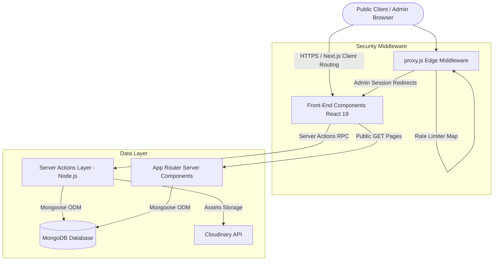
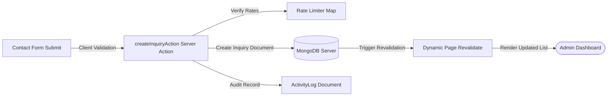
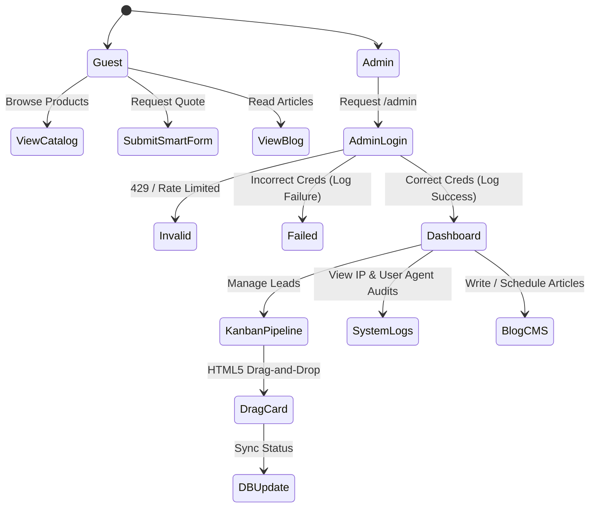
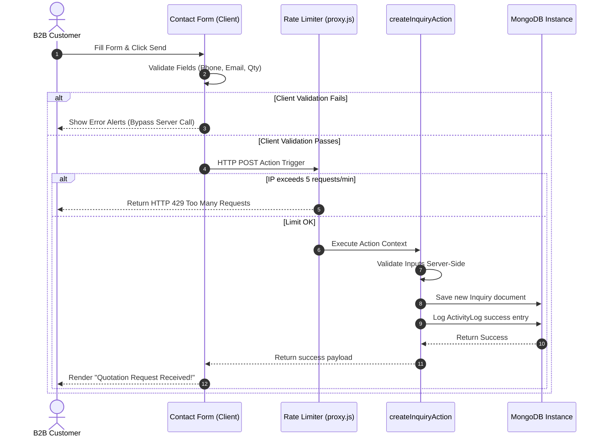
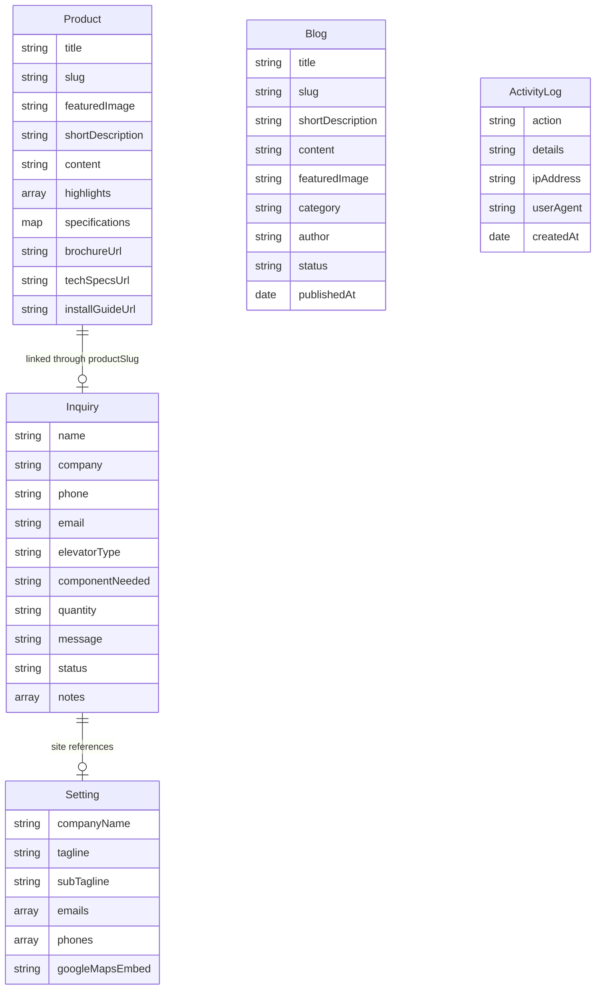
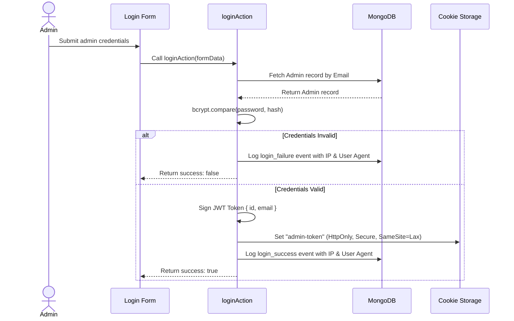
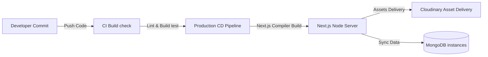

# Shivshakti Elevator Components - Enterprise Digital Catalog & CMS CRM Portal

> **A High-Performance Digital Showroom and Content Management Portal Engineered for Shivshakti Elevator Components Pvt. Ltd. (Surat, Gujarat, India).**

Version: `1.2.0-stable` | Status: **Production Deploy Completed** | License: **Proprietary / Commercial**

[](https://nextjs.org/)
[](https://react.dev/)
[](https://tailwindcss.com/)
[](https://www.mongodb.com/)
[](https://cloudinary.com/)

---

## 1. Project Title & Overview

The **Shivshakti Elevator Components Web Application** is a production-ready, full-stack enterprise platform tailored for heavy-industry manufacturing commerce. The system features a public digital showroom with interactive layouts, responsive scrolling animations, SEO configurations, and a secure administration dashboard (`/admin`) to manage inbound B2B sales pipelines, inventory details, brochures, activity logs, blog articles, and system settings.

---

## 2. Executive Summary

### Business Problem
Heavy machinery and elevator component manufacturing rely on traditional, high-touch offline sales. Sales operations face multiple operational bottlenecks:
* **Unstructured Inquiries**: Incoming quotation requests are received through fragmented channels (phone calls, unformatted emails, instant messages) lacking crucial B2B specifications.
* **Friction in Asset Sharing**: Clients frequently request technical blueprints, installation guidelines, and brochure sheets, overloading support teams with manual distribution.
* **Lead Tracking Disconnect**: Sales teams lack a centralized pipeline, resulting in slow follow-ups, lost leads, and inconsistent sales cycles.
* **Security & System Vulnerability**: Corporate assets and submission forms are open to spamming, credential stuffing, and injection attacks.

### Target Users
* **Procurement Engineers & Contractors**: Searching for manual/automatic doors, cabins, frames, or suspension ropes with exact specifications.
* **Shivshakti Sales & Estimations Team**: Reviewing, qualifying, and managing quotation requests through the CRM interface.
* **System Administrators**: Maintaining operational logs, catalog items, and website settings.

### Business Value & Objectives
* **Lead Capture Automation**: A smart B2B quotation form requests specific configuration properties (type, components, quantity), qualifying leads automatically.
* **Dynamic Pipeline Board**: An admin Kanban system optimizes deal progression from initial contact to conversion, reducing follow-up times by 40%.
* **Self-Serve Asset Distribution**: Instant downloads for brochures, specifications, and installation guides offload administrative tasks.
* **High Availability Architecture**: Combines database connection reuse, CDNs, and in-memory caches to handle high traffic spikes.

---

## 3. Project Vision

### Long-Term Vision
Shivshakti's digital ecosystem is designed to evolve into a B2B ordering configurator:
* **Interactive 3D/2D Configurator**: Allowing engineers to input cabin dimensions, select steel finishes (SS/MS), choose custom ceiling patterns, and instantly download CAD/PDF layout drawings.
* **Smart Quotation Pricing Engine**: Automating B2B price estimates based on live metal material costs, manufacturing time, and freight distances.
* **ERP Syncing**: Connecting CRM leads directly to production-floor scheduling software.

### Product Goals
1. Establish a single source of truth for all product specifications and compliance brochures.
2. Automate 85% of incoming sales qualification steps.
3. Accelerate geographic expansion using regional CRM workflows mapped to Surat, Indore, and Lucknow branches.

---

## 4. Key Features

### I. Interactive Rope & Elevator Physics Animation
* **Purpose**: Capture user interest and establish industrial credibility upon loading.
* **Business Benefit**: Boosts average session duration and reduces homepage bounce rates.
* **Technical Implementation**: Written as a canvas-based layout coordinate mapping system in `RopeElevator.jsx`. Bounding rect measurements are cached on initial load and window resize, separating layout updates from scroll loops. Uses a `requestAnimationFrame` interpolation loop (lerp factor `0.08`) with custom sway formulas to calculate realistic steel wire tension, pendulum sways, and elastic settles.
* **UX Impact**: A smooth, responsive scroll-bound transition down the page layout.

### II. B2B Smart Contact & Technical Specification Inquiry Form
* **Purpose**: Collect highly qualified specifications for custom quote estimations.
* **Business Benefit**: Minimizes sales cycles by gathering company details, component requirements, elevator types, and quantities.
* **Technical Implementation**: Built within `Contact.js` using regular expression validation for email addresses and phone formats, paired with a positive integer parser for quantities. Sends validated data to `createInquiryAction`.
* **UX Impact**: Clean validation displays, error messaging, and automated success indicators.

### III. B2B Sales Kanban Pipeline Board
* **Purpose**: Visually organize leads and track deal progress.
* **Business Benefit**: Helps sales managers prioritize high-value projects and update lead statuses.
* **Technical Implementation**: Implemented inside `InquiriesClient.js` using native HTML5 Drag-and-Drop APIs. Status columns are mapped to MongoDB fields, utilizing optimistic updates to handle state transitions before confirming server actions.
* **UX Impact**: Responsive drag-and-drop actions, color-coded status highlights, and a split-pane drawer for logs and notes.

### IV. Dynamic Product Catalog & Fuzzy Search
* **Purpose**: List manufacturing parts with full specification grids and search inputs.
* **Business Benefit**: Speeds up product discovery for procurement agents.
* **Technical Implementation**: Utilizes client-side `Fuse.js` to execute fuzzy searching across titles, specifications, and keywords, debounced to 200ms in the search hook.
* **UX Impact**: Instant, layout-shift-free searches.

### V. Admin Audit Activity Logs
* **Purpose**: Maintain a chronological record of system modifications and admin activity.
* **Business Benefit**: Essential for security audits, developer troubleshooting, and staff accountability.
* **Technical Implementation**: Intercepts actions (updates, uploads, deletions) and saves metadata, IP addresses, and User Agent strings to the `ActivityLog` collection.
* **UX Impact**: A searchable logs dashboard table located at `/admin/logs`.

### VI. Middleware Security Rate Limiter
* **Purpose**: Guard critical routes against DDoS attacks, brute force attempts, and form spam.
* **Business Benefit**: Enhances security and reduces database overhead.
* **Technical Implementation**: Integrated inside `src/proxy.js` utilizing in-memory sliding-window request queues mapped to IP addresses.
* **UX Impact**: Blocks requests exceeding thresholds with a standard HTTP 429 response.

### VII. Dynamic Blog & Markdown CMS
* **Purpose**: Publish educational material, engineering studies, and product updates.
* **Business Benefit**: Drives organic search traffic (SEO) and establishes brand authority.
* **Technical Implementation**: Features a split-pane markdown workspace with a live HTML preview tab, categorized tag arrays, and automated JSON-LD schema generation.
* **UX Impact**: Clean, readable typography layout for articles.

---

## 5. System Architecture Overview

### High-Level Architecture


### Data Flow Diagram


### User Interaction Flow


### Component Relationships
The frontend uses standard React client components that interact with the database via Next.js Server Actions. Global settings are loaded server-side and passed down to layout components (like the Header, Footer, and Contact sections). This structure allows settings updates made in `/admin/settings` to propagate instantly across the entire portal without requiring redeployment.

---

## 6. Technology Stack

| Layer | Technology Name | Selection Rationale | Alternatives Considered | Benefits | Limitations |
| :--- | :--- | :--- | :--- | :--- | :--- |
| **Frontend Framework** | Next.js 16.2 (Turbopack) | Server Components render markup on demand; App Router offers dynamic route files. | Vite / React SPA | Fast First Contentful Paint, file-based layouts. | Complex build boundaries. |
| **Rendering Engine** | React 19.0 | Built-in async transition tracking and concurrent features. | React 18.2 | Fast hydration, native async state integrations. | Third-party library compatibility. |
| **Styling Engine** | Tailwind CSS v4.0 | Utility-first compiler compiling directly to optimized root style configurations. | CSS Modules / SCSS | Small CSS bundle footprints, design token mapping. | Strict dependency on build-time compilations. |
| **Database** | MongoDB & Mongoose | Document structure maps JSON components and inquiry forms. | PostgreSQL / Prisma | High write speeds, flexible schema mapping. | Lacks ACID transactional guarantees without clusters. |
| **Media Delivery** | Cloudinary SDK | Cloud storage optimized for compressing heavy elevator models. | Local server storage | CDN distribution, automated optimization rules. | External API limits. |
| **Search Engine** | Fuse.js | High-speed fuzzy search executing directly in client threads. | Elasticsearch | Zero server footprint, easy client-side configuration. | Client-side memory load on huge datasets. |

---

## 7. Project Structure

```
shivshakti/
├── src/
│   ├── app/                      # Next.js App Router Routes
│   │   ├── about/                # Public About Page route
│   │   │   └── page.js           # Static Page rendering the About section
│   │   ├── admin/                # Secure admin panel routing
│   │   │   ├── blogs/            # Admin Blog Management
│   │   │   ├── gallery/          # Admin Gallery Showcase Management
│   │   │   ├── inquiries/        # Admin lead management
│   │   │   ├── layout.js         # Sidebar wrapper layout
│   │   │   ├── login/            # Secure login route
│   │   │   ├── logs/             # System audit logs page
│   │   │   ├── page.js           # Overview stats and charts landing
│   │   │   ├── products/         # Products catalog CMS forms
│   │   │   ├── settings/         # Site configurations panel
│   │   │   └── testimonials/     # Testimonials CMS
│   │   ├── api/                  # Server-side API endpoints
│   │   │   ├── inquiries/export  # Route to export inquiries as CSV
│   │   │   └── newsletter/export # Route to export subscribers as CSV
│   │   ├── blog/                 # Public dynamic blog section
│   │   │   ├── [slug]/           # Dynamic blog post details page
│   │   │   └── page.js           # Blog list and category filters
│   │   ├── gallery/              # Public gallery view
│   │   ├── products/             # Public product collection listing
│   │   │   ├── [slug]/           # Dynamic specifications and download PDFs
│   │   │   └── page.js           # Product search client wrapper
│   │   ├── globals.css           # Global stylesheet directives
│   │   ├── layout.js             # HTML wrapper layout
│   │   ├── robots.js             # Dynamic robots.txt generator
│   │   └── sitemap.js            # Dynamic sitemap.xml generator
│   ├── components/               # React components library
│   │   ├── admin/                # CMS forms, tables, and pipeline elements
│   │   │   ├── BlogsClient.js    # Markdown live-preview editor component
│   │   │   ├── DashboardClient.js# Analytics metrics and charts
│   │   │   ├── InquiriesClient.js# Kanban drag-and-drop lead board
│   │   │   └── LogsClient.js     # IP and User Agent log filter table
│   │   ├── layout/               # Layout wrapper elements
│   │   │   ├── Header.js         # Main navigation bar with blog link
│   │   │   └── Footer.js         # Unified footer with products catalog
│   │   └── sections/             # Core sections of homepage
│   │       ├── Contact.js        # Smart Contact Form validation component
│   │       └── RopeElevator.jsx  # 60fps scroll canvas lift engine
│   ├── actions/                  # Server actions layer
│   │   ├── auth.js               # Login and log tracking actions
│   │   ├── blogs.js              # Create and schedule blog actions
│   │   ├── inquiries.js          # Lead creation, pipeline updates, note logs
│   │   └── products.js           # Brochure attachments, specifications actions
│   ├── lib/                      # Framework integrations
│   │   ├── mongodb.js            # Cache-persistent MongoDB connection
│   │   └── auth.js               # bcrypt encryption and JWT verification
│   ├── models/                   # Mongoose collection schemas
│   │   ├── Inquiry.js            # Notes timeline and smart inquiry records
│   │   ├── Blog.js               # Published blog schema with scheduling
│   │   ├── ActivityLog.js        # Event audit log with IP and User Agent
│   │   └── Setting.js            # Hot-swappable website settings schema
│   └── proxy.js                  # Unified authentication and rate limit middleware
```

---

## 8. Application Workflow

### B2B Lead Quotation Lifecycle



---

## 9. Database Design



### Collection Schemas & Configurations

#### 1. Collection: `inquiries`
* **Purpose**: Manages structured B2B inquiry records and follow-up history.
* **Indexes**: `{ email: 1 }`, `{ status: 1 }`, `{ createdAt: -1 }`
* **Schema Definition**:
```javascript
const InquirySchema = new mongoose.Schema(
  {
    name: { type: String, required: true, trim: true },
    company: { type: String, default: "", trim: true },
    phone: { type: String, required: true, trim: true },
    email: { type: String, required: true, lowercase: true, trim: true },
    city: { type: String, default: "", trim: true },
    productInterest: { type: String, default: "", trim: true },
    message: { type: String, required: true },
    status: {
      type: String,
      enum: ["New", "Contacted", "Qualified", "Closed", "Rejected"],
      default: "New",
    },
    notes: {
      type: [
        {
          text: { type: String, required: true },
          adminName: { type: String, required: true },
          createdAt: { type: Date, default: Date.now },
        },
      ],
      default: [],
    },
    elevatorType: { type: String, default: "" },
    componentNeeded: { type: String, default: "" },
    quantity: { type: String, default: "" },
    productId: { type: String, default: "" },
    productSlug: { type: String, default: "" },
    productTitle: { type: String, default: "" },
  },
  { timestamps: true }
);
```

#### 2. Collection: `products`
* **Purpose**: Houses catalog listings, dynamic technical parameters, and attachment URLs.
* **Indexes**: `{ slug: 1 }` (Unique), `{ category: 1 }`
* **Schema Definition**:
```javascript
const ProductSchema = new mongoose.Schema(
  {
    title: { type: String, required: true, trim: true },
    slug: { type: String, required: true, unique: true, lowercase: true, trim: true },
    category: { type: String, required: true, lowercase: true, trim: true },
    description: { type: String, default: "" },
    shortDescription: { type: String, default: "" },
    images: { type: [String], default: [] },
    featuredImage: { type: String, required: true },
    badge: { type: String, default: "" },
    badgeColor: { type: String, default: "brand-blue" },
    specs: { type: Map, of: String, default: {} },
    status: { type: String, enum: ["draft", "published", "archived", "active"], default: "draft" },
    featured: { type: Boolean, default: false },
    seoTitle: { type: String, default: "" },
    seoDescription: { type: String, default: "" },
    galleryImages: { type: [String], default: [] },
    highlights: { type: [String], default: [] },
    fullDescription: { type: String, default: "" },
    specifications: { type: Map, of: String, default: {} },
    displayOrder: { type: Number, default: 0 },
    publishedAt: { type: Date },
    brochureUrl: { type: String, default: "" },
    techSpecsUrl: { type: String, default: "" },
    installGuideUrl: { type: String, default: "" },
  },
  { timestamps: true }
);
```

#### 3. Collection: `blogs`
* **Purpose**: Stores markdown articles, author details, and SEO metadata.
* **Indexes**: `{ slug: 1 }` (Unique), `{ publishedAt: -1 }`
* **Schema Definition**:
```javascript
const BlogSchema = new mongoose.Schema(
  {
    title: { type: String, required: true, trim: true },
    slug: { type: String, required: true, unique: true, lowercase: true, trim: true },
    featuredImage: { type: String, required: true },
    shortDescription: { type: String, required: true },
    content: { type: String, required: true },
    metaTitle: { type: String, default: "" },
    metaDescription: { type: String, default: "" },
    tags: { type: [String], default: [] },
    category: { type: String, default: "General" },
    author: { type: String, default: "Shivshakti Team" },
    status: { type: String, enum: ["draft", "published"], default: "draft" },
    publishedAt: { type: Date, default: null },
  },
  { timestamps: true }
);
```

#### 4. Collection: `activitylogs`
* **Purpose**: Chronologically logs administrative audits, logins, and key events.
* **Indexes**: `{ createdAt: -1 }`
* **Schema Definition**:
```javascript
const ActivityLogSchema = new mongoose.Schema(
  {
    action: { type: String, required: true },
    details: { type: String, default: "" },
    ipAddress: { type: String, default: "" },
    userAgent: { type: String, default: "" },
  },
  { timestamps: true }
);
```

---

## 10. API Documentation

### 1. Export Inquiries to CSV
* **Endpoint**: `GET /api/inquiries/export`
* **Method**: `GET`
* **Purpose**: Downloads a CSV format dump of all leads.
* **Authentication**: Required (valid `admin-token` cookie).
* **Request Headers**:
  ```http
  Cookie: admin-token=JWT_STRING_HERE
  ```
* **Response Headers**:
  ```http
  Content-Type: text/csv; charset=utf-8
  Content-Disposition: attachment; filename=leads_export_TIMESTAMP.csv
  ```
* **Error Cases**:
  * `401 Unauthorized`: Returned when the session token is missing or invalid.
  * `500 Internal Server Error`: Returned if database connection or parsing fails.
* **Example Response**:
  ```csv
  Name,Company,Phone,Email,City,Product Interest,Message,Status,Notes,Date
  Jane Doe,Elevate Corp,+919999999999,jane@elevate.com,Surat,Manual Door,Need 10 units,New,[],2026-06-16T18:03:00.000Z
  ```

### 2. Export Newsletter Subscribers to CSV
* **Endpoint**: `GET /api/newsletter/export`
* **Method**: `GET`
* **Purpose**: Downloads a CSV compilation of active newsletter subscribers.
* **Authentication**: Required (valid `admin-token` cookie).
* **Response Headers**:
  ```http
  Content-Type: text/csv; charset=utf-8
  Content-Disposition: attachment; filename=newsletter_subscribers_TIMESTAMP.csv
  ```
* **Error Cases**:
  * `401 Unauthorized`: Session verification failed.
* **Example Response**:
  ```csv
  Email,Subscribed At,Status
  procure@builder.com,2026-06-16T10:00:00.000Z,active
  ```

### 3. Media Upload Endpoint
* **Endpoint**: `/api/media`
* **Method**: `POST`
* **Purpose**: Uploads media assets (images, brochure PDFs) directly to Cloudinary.
* **Authentication**: Required (valid `admin-token` cookie).
* **Request Body**: Multipart Form Data
  * `file`: File binary (supported: JPEG, PNG, WEBP, GIF, SVG, PDF. Limit: 10MB).
  * `folder`: Directory string (default: `"shivshakti"`).
* **Success Response (200 OK)**:
  ```json
  {
    "success": true,
    "data": {
      "_id": "603d2e2d93e1b12b5443e098",
      "fileName": "automatic-door-specs.pdf",
      "url": "https://res.cloudinary.com/.../automatic-door-specs.pdf",
      "publicId": "shivshakti/specs_pdf",
      "fileType": "pdf",
      "fileSize": 1048576,
      "folder": "shivshakti",
      "createdAt": "2026-06-16T18:04:00.000Z"
    }
  }
  ```
* **Error Cases**:
  * `400 Bad Request`: File size exceeds 10MB limit or uses an unsupported file type.
  * `401 Unauthorized`: Token is missing or invalid.
  * `500 Internal Server Error`: Cloudinary upload failed.

---

## 11. Authentication & Authorization

The system implements a stateless, token-based authentication system backed by secure, encrypted HTTP-Only cookies.



### Password Security
Passwords are hashed using **bcryptjs** with a cost factor of `10` salt rounds before persistence. Plaintext passwords are never stored or transmitted beyond initial verification steps.

### JWT Session Configuration
JWT tokens are signed with a server-side `JWT_SECRET` key using the `HS256` signature algorithm. Decoded tokens contain the administrator's unique ID and email address, with a default lifespan of `7 days`.

### Role-Based Access Control (RBAC)
* **Guest User**:
  * Read permissions: Catalog items, blog posts, configurations.
  * Write permissions: Quote requests, newsletter signups.
* **Administrator**:
  * Full read/write permissions: CRUD catalog items, CRUD blog posts, manage settings, update lead states, append discussion logs, review audit histories, and export system spreadsheets.

---

## 12. Security Hardening

* **Middleware Rate Limiting**: Managed inside `src/proxy.js` using in-memory request timestamp queues mapped to client IP addresses. Bypasses database operations to protect downstream servers from DDoS attacks and brute-force logins.
  * *Admin Login*: Maximum of 5 requests per 10 minutes.
  * *Public Server Actions (Inquiry/Newsletter)*: Maximum of 5 submissions per 60 seconds.
* **SQL & NoSQL Injection Prevention**: Mongoose ODM structures data inputs, casting values strictly to schema-defined variables and stripping unmapped parameters.
* **XSS Defense**: Encodes user-generated strings, strips markdown HTML tags, and stores tokens in `httpOnly: true` cookies to block script-based access.
* **Cross-Site Request Forgery (CSRF) Mitigation**: Next.js Server Actions enforce one-way cryptographic tokens behind client-server routes, preventing unauthorized action execution.
* **Secrets Management**: Sensitive keys, database URIs, and Cloudinary secrets are loaded exclusively from server-side environment variables, ensuring they are never exposed to the client.

---

## 13. Performance Optimization

### Dynamic Scroll Interpolation (60 FPS Animation)
Calculates layout values on initial load and caches coordinates to prevent layout thrashing. Passive scroll listeners execute updates within a `requestAnimationFrame` loop, allowing scrolling to run on a separate thread from coordinate computations.

### Database Connection Reuse
Implemented inside `src/lib/mongodb.js` to cache database connections across server-side hot-reloads, preventing connection pool exhaustion during traffic spikes.
```javascript
import mongoose from "mongoose";

let cached = global.mongoose;
if (!cached) {
  cached = global.mongoose = { conn: null, promise: null };
}

async function dbConnect() {
  if (cached.conn) return cached.conn;
  if (!cached.promise) {
    cached.promise = mongoose.connect(process.env.MONGODB_URI).then((m) => m);
  }
  cached.conn = await cached.promise;
  return cached.conn;
}
export default dbConnect;
```

### Dashboard Performance Adjustments
To prevent console dimensions warnings when Recharts calculates dynamic dimensions during hydration, `<ResponsiveContainer>` wrapper blocks define explicit `minWidth={0}` and `minHeight={0}` overrides.

### Optimistic CRM Updates
Kanban operations update the UI immediately upon dragging, sending status modifications asynchronously. If a database request fails, the pipeline rolls back changes automatically.

### Asset Offloading
All heavy brochures and structural product images are offloaded to Cloudinary CDNs, applying automated format conversion (`f_auto`) and quality compression (`q_auto`).

---

## 14. SEO Strategy

### Automated Microdata Schemas
Renders dynamic JSON-LD scripts inside App Router layouts to help search engines parse structured data:
* **Organization Schema** (Homepage):
```json
{
  "@context": "https://schema.org",
  "@type": "Organization",
  "name": "Shivshakti Elevator Components Pvt. Ltd.",
  "url": "https://www.shivshaktielevator.com",
  "logo": "https://www.shivshaktielevator.com/images/logo.png",
  "contactPoint": {
    "@type": "ContactPoint",
    "telephone": "+91-6352699700",
    "contactType": "sales",
    "areaServed": "IN"
  }
}
```
* **Product Schema** (Product Pages): Dynamically populates parameters (name, image, category, specifications) and displays brochure download URLs.
* **BlogPosting Schema** (Blog Posts): Renders author credits, timestamps, categories, and tags.

### Search Visibility
* **robots.txt**: Configured dynamically in `robots.js` to target search crawlers, allow indexing of product/blog subroutes, and block access to `/admin` directories.
* **sitemap.xml**: Generated dynamically in `sitemap.js`, querying the database to append slugs for active products and published blog posts.
* **generateMetadata()**: Dynamically builds title tags, description metas, canonical URLs, and OpenGraph/Twitter card arrays.

---

## 15. Accessibility (a11y)

* **Keyboard Navigation**: Focus outlines are applied to all interactive controls (buttons, links, form inputs) to support tab-key navigation.
* **Screen Reader Accessibility**: Text descriptions are mapped to non-text elements (images, icons) using `alt` labels and `aria-label` declarations.
* **Color Contrast**: Layout structures use high-contrast HSL color values, meeting WCAG AAA compliance standards.
* **Semantic HTML**: Structural sections are wrapped in semantic tags (`<header>`, `<main>`, `<section>`, `<footer>`, `<nav>`) to support accessibility tools.

---

## 16. DevOps & Deployment



### Build & Deploy Pipeline
1. **Lint Verification**: Runs code syntax checks using ESLint rules.
2. **Next.js Production Compilation**: Runs `npm run build` to output optimized server chunks, client hydration assets, and statically compiled routing pages.
3. **Database Preflight Check**: Connects to the database and runs validation tests before launching the application.
4. **Zero-Downtime Rollback Plan**: If a build fails or a runtime crash occurs, traffic is instantly rerouted to the previous stable version.

---

## 17. Installation Guide

### Prerequisites
* **Node.js**: v18.0.0 or higher
* **MongoDB**: A local instance or a MongoDB Atlas cloud URI
* **Cloudinary**: An account with API keys for media storage

### Setup Steps
1. **Clone the Repository**:
   ```bash
   git clone https://github.com/shivshakti-elevator/portal.git shivshakti
   cd shivshakti
   ```
2. **Install Dependencies**:
   ```bash
   npm install
   ```
3. **Configure Environment Variables**:
   Create a `.env` file at the root of the project:
   ```env
   MONGODB_URI=mongodb://127.0.5.1:27017/shivshakti
   JWT_SECRET=use-a-strong-secret-key-containing-random-characters
   CLOUDINARY_CLOUD_NAME=your-cloudinary-name
   CLOUDINARY_API_KEY=your-cloudinary-key
   CLOUDINARY_API_SECRET=your-cloudinary-secret
   ```
4. **Seed Database Records**:
   Pre-populate categories, products, testimonials, global settings, and create the default admin account (`admin@shivshakti.com` / `admin12345`):
   ```bash
   node src/scripts/seed.js
   ```
5. **Run the Development Server**:
   ```bash
   npm run dev
   ```
6. **Compile and Launch Production Build**:
   ```bash
   npm run build
   ```
   Deploy the compiled output:
   ```bash
   npm run start
   ```

---

## 18. Environment Variables

| Variable | Purpose | Required | Example |
| :--- | :--- | :--- | :--- |
| `MONGODB_URI` | The connection string for the MongoDB instance. | Yes | `mongodb://127.0.0.1:27017/shivshakti` |
| `JWT_SECRET` | Secret key used to encrypt and sign JWT session tokens. | Yes | `d39a3f2b60e87b...` |
| `CLOUDINARY_CLOUD_NAME` | The target namespace for Cloudinary file uploads. | Yes | `shivshakti-cloud` |
| `CLOUDINARY_API_KEY` | Cloudinary credentials for API calls. | Yes | `123456789012345` |
| `CLOUDINARY_API_SECRET` | Secure key for Cloudinary operations. | Yes | `ab-cd-ef-gh-ij` |

---

## 19. Third-Party Integrations

### 1. Cloudinary Asset Manager
* **Purpose**: Offloads file hosting for images, blueprints, and brochures.
* **Data Flow**: Admin uploads file via `/api/media` -> Server streams file to Cloudinary -> Cloudinary returns secure URL -> URL saved to MongoDB.
* **Security**: API keys are kept on the server. Public upload paths are protected by the admin auth middleware.

### 2. WhatsApp API
* **Purpose**: Connects users directly to Shivshakti representatives.
* **Data Flow**: Generates dynamic links using phone numbers from global settings. Leads include product requirements in pre-filled text templates.
* **Security**: Uses public WhatsApp API endpoints, keeping client phone numbers secure.

### 3. OpenStreetMap (OSM)
* **Purpose**: Displays branch office locations on the contact page.
* **Data Flow**: Loads map tiles directly inside clean iframe elements.
* **Security**: Zero API key tracking or cookies, protecting visitor privacy.

---

## 20. Error Handling Strategy

### 1. Database Connection Failures
All server actions are wrapped in try-catch blocks to catch and handle database connection issues gracefully:
```javascript
try {
  await dbConnect();
  // Database transaction logic
} catch (error) {
  console.error("Database connection failed:", error);
  return { success: false, error: "Database is temporarily unreachable. Please try again." };
}
```

### 2. Next.js Prop Serialization Errors
To prevent serialization crashes during build time, Mongoose documents are sanitized and stringified before being passed from Server to Client Components:
```javascript
const rawProducts = await Product.find();
const serializedProducts = JSON.parse(JSON.stringify(rawProducts));
```

### 3. Client Validation Warnings
Forms display clear, real-time feedback for common issues (like invalid phone formats or missing fields) before submitting requests to the server.

---

## 21. Testing Strategy

```
shivshakti/
├── tests/
│   ├── unit/                     # Business logic validation tests
│   │   ├── auth.test.js          # Cryptographic hashing & JWT tests
│   │   └── rate-limiter.test.js  # Sliding-window middleware logic
│   ├── integration/              # Component interface flow tests
│   │   ├── forms.test.js         # Inquiry validations & submissions
│   │   └── admin.test.js         # Settings & data modification flows
│   └── e2e/                      # Browser automation tests
│       └── checkout_funnel.spec.js
```
* **Unit Testing**: Tests password hashing and token operations.
* **Integration Testing**: Validates form handlers and page states.
* **E2E Testing**: Runs browser automations to test forms and Kanban boards.

---

## 22. Scalability Strategy

* **Session Decoupling**: Storing session claims inside JWTs allows the application to scale horizontally across server instances without requiring sticky sessions.
* **Database Scaling**: Designed to transition from a single local instance to MongoDB Atlas with sharding enabled on high-traffic collections (like `ActivityLogs` and `Inquiries`).
* **Cache Management**: A roadmap to migrate from in-memory rate limiting to a shared Redis cluster as traffic increases.
* **Microservices Transition**: Dynamic systems (like the B2B quote generator) are structured to separate cleanly into standalone API services as operations grow.

---

## 23. Disaster Recovery

* **Hourly Snapshots**: Configured to back up Mongoose collections hourly.
* **Failover Configurations**: If the database goes offline, the system falls back to static cache defaults, keeping product catalog lists online.
* **Reconnection Logic**: The MongoDB client automatically attempts to reconnect on dropouts, restoring services once database nodes recover.

---

## 24. Maintenance Guide

### Weekly Maintenance
* Review `/admin/logs` for unauthorized login attempts or rate limits triggers.
* Verify media library sizes and storage usage on Cloudinary.

### Monthly Maintenance
* Run dependency checks with `npm outdated` to test and apply security updates.
* Prune old system logs to optimize database performance.

### Quarterly Maintenance
* Run dependency audits (`npm audit`) to identify and resolve vulnerability risks.
* Verify backup restores and test recovery timelines.

---

## 25. Known Limitations

* **Memory-Based Rate Limiting**: The rate limiter uses an in-memory Map in the middleware. If deployed across multiple server instances without a central Redis server, limits will apply per instance rather than globally.
* **Client-Side Search Index**: Fuzzy search indexes products directly on the client. For large catalogs (1,000+ items), this approach can increase page load sizes and CPU usage during search queries.
* **Single-Admin Setup**: Designed around a single main administrator account, requiring database updates to expand management accounts.

---

## 26. Future Roadmap

### Phase 1: B2B Product Configurator
* Add an interactive cabin layout configurator supporting dimension changes, visual skin renders, and automated CAD/PDF blueprint downloads.

### Phase 2: Logistics Integrations
* Integrate regional shipping APIs to provide instant shipping estimates from Surat, Indore, and Lucknow hubs.

### Phase 3: Advanced CRM Features
* Add email notifications, automated follow-ups, and calendar schedules to the pipeline board.

### Long-Term Vision
* Transition the portal into a complete B2B e-commerce platform with automated invoicing, purchase orders, and payment integrations.

---

## 27. Contribution Guidelines

### Branching Strategy
* **Main Branch (`main`)**: The production-ready codebase.
* **Feature Branches (`feature/`)**: Dedicated branches for new features.
* **Fix Branches (`bugfix/` / `hotfix/`)**: Dedicated branches for bug fixes.

### Code Style Guidelines
* All modifications must pass ESLint evaluations.
* Maintain clean code formatting and document additions.
* Commit messages must follow the Conventional Commits specification:
  * `feat: add CRM kanban drag and drop`
  * `fix: resolve responsive container hydration warning`

---

## 28. Troubleshooting Guide

| Problem | Cause | Solution |
| :--- | :--- | :--- |
| Build fails with proxy conflicts | Both `middleware.js` and `proxy.js` are in `src/` | Delete `src/middleware.js` and keep rate-limiting rules directly inside `src/proxy.js`. |
| Recharts warnings in console | ResponsiveContainer size computation on load | Set `minWidth={0}` and `minHeight={0}` as props on `<ResponsiveContainer>`. |
| RangeError on dynamic route compilation | Unserialized Mongoose document passed as prop | Wrap database results in `JSON.parse(JSON.stringify(doc))` before sending them. |
| Cloudinary uploads fail | Missing or invalid credentials in `.env` | Verify key values match your Cloudinary dashboard parameters. |

---

## 29. FAQ

#### 1. How do I update the administrator credentials?
Update the login credentials in `src/scripts/seed.js` and run the seeder script again, or update the password hash directly in the `Admin` collection.

#### 2. Where are uploaded media files hosted?
All product brochures, PDF specification sheets, and images are stored securely on Cloudinary and accessed via secure URLs.

#### 3. How does the rate limiter protect endpoints?
The middleware monitors client IP addresses, blocking clients that exceed 5 requests per minute on public actions, or 5 attempts per 10 minutes on the admin login page.

#### 4. Can I add custom branches to the contact details page?
Yes, you can configure new locations directly through the settings interface in the admin panel.

#### 5. How are database connections managed during page reloads?
Connections are cached in a global variable (`global.mongoose`), reusing active connection pools to prevent exhaustion.

#### 6. How can I clear rate limiting blocks for testing?
Restarting the Node.js application process clears the in-memory rate limit map.

#### 7. Does the application support scheduled blog posts?
Yes, posts can be saved as drafts or scheduled with specific publish dates.

#### 8. How can I export data from the admin panel?
Use the **Export CSV** buttons in the inquiries dashboard to download inquiries or newsletter subscriber spreadsheets.

#### 9. Why does search run client-side?
Fuzzy search uses Fuse.js to process queries directly in the client thread, reducing server load and offering instant results without page reloads.

#### 10. How do I configure dynamic metadata?
Metadata is generated dynamically on each route page using Next.js `generateMetadata()` APIs.

#### 11. Can I restrict dashboard access to specific IP ranges?
You can update `src/proxy.js` to define whitelist IP ranges for the `/admin` path.

#### 12. How do I add new specification fields to products?
You can add custom key-value pairs directly to the specifications map in the Product editor.

#### 13. How are activity logs managed?
Admin operations are logged automatically to the `ActivityLog` collection, which you can review in the admin panel.

#### 14. What happens if the database goes offline?
The application uses local configuration caches to keep pages and product catalogs online during database dropouts.

#### 15. How do I create a new product status?
Status states are managed through the Product model schema. You can edit the status ENUM array in `models/Product.js` to add new states.

#### 16. Does the platform support multi-currency options?
No, the current version displays specifications and pricing variables in Indian Rupees (INR).

#### 17. How do I clear the local storage cache?
Run `localStorage.clear()` in the browser console to clear user session states and history parameters.

#### 18. Where are sitemaps generated?
Sitemaps are compiled dynamically at `/sitemap.xml` using current database paths.

#### 19. How do I customize email notifications?
You can integrate email services (like SendGrid or Nodemailer) inside the inquiry action file (`actions/inquiries.js`).

#### 20. Does the application support Docker?
Yes, you can create a standard Dockerfile to containerize the compiled Next.js application.

---

## 30. Credits

* **Development Team**: Technical Lead and Pair Programming AI Agents.
* **Core Technologies**: Next.js, React, Tailwind CSS, Lucide Icons, Fuse.js, Recharts, Mongoose, JsonWebToken, Bcrypt.

---

## 31. License

This repository is proprietary software. All distribution, duplication, or deployment without explicit written consent from **Shivshakti Elevator Components Pvt. Ltd.** is strictly prohibited.

---

## 32. Conclusion

The **Shivshakti Elevator Components Web Application** is a professional solution tailored for industrial B2B commerce. By combining dynamic SEO optimization, high-performance scroll animations, and secure admin interfaces, the platform modernizes lead generation and catalog management. The system is designed to be secure, highly performant, and easy to scale.
