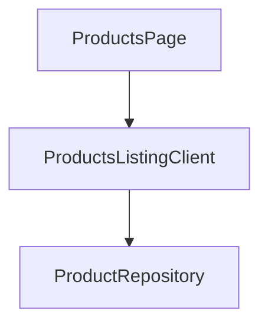

# Products Feature Module

This module manages the display of product listings, details pages, responsive images, product inquiry forms, and administration systems to upload/edit product lines.

## Structure

- **components/**: Product layout panels and client controllers
  - `Admin/ProductsClient.js`: Admin inventory control table and details editing drawer
  - `HomeProducts.js`: Interactive carousel card grid for the home screen
  - `ProductDetailClient.js`: Detail page with image gallery and spec tables
  - `ProductsListingClient.js`: Categorized paginated catalog list
  - `ProductImage.js`: Optimized layout picture element supporting lazy-loading
  - `ProductInquiryForm.js`: Inquiry sidebar/modal for specific variants
- **repositories/**: Data access layer
  - `product.repository.js`: Unified MongoDB actions (fetching catalogs, details, categories, updating stats)
- **services/**: Business operations actions
  - `actions.js`: Server actions managing edits, duplications, category additions, and deletions
- **index.js**: Standardized public API barrel file

## Unidirectional Architecture

- UI Client Components may query repositories directly for read-only operations to ensure fast data fetching.
- Mutation logic is strictly routed through Server Actions (Services) inside `services/actions.js`.
