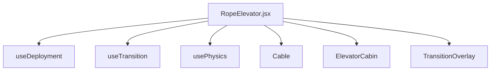

# Rope Elevator Feature Module

This module manages the interactive 3D/2D physical rope elevator simulation that follows user scrolling, handles elastic settlement drops, and orchestrates page transition cinematic overlays.

## Structure

- **components/**: Presentation SVGs, panels, and cabin layout elements
  - `Cable.jsx`: Renders the steel wire rope and guide rails
  - `ElevatorCabin.jsx`: Structure, light glow, character placement
  - `ElevatorDoors.jsx`: Interactive sliding split door panels
  - `Characters.jsx`: Animated hand-drawn vector characters
  - `TransitionOverlay.jsx`: Cinematic expanding zoom page loader modal
  - `RopeElevator.jsx`: Root orchestration entry component
- **hooks/**: Encapsulated lifecycle/loop state hooks
  - `useDeployment.js`: Intercepts scroll and animates the initial elastic drop
  - `useTransition.js`: Coordinates page container positions and resize metrics
  - `usePhysics.js`: High-performance 60FPS loop for inertia, sways, doors, and characters
- **constants/**: Dimension config, bounds, timings
  - `dimensions.js`: Responsive viewport overlaps and breakpoints
  - `physics.js`: Easing speeds, sways, bounce coefficients
- **utils/**: Internal math functions
  - `math.js`: Clamp and linear interpolation helper functions
- **index.js**: Standardized public API barrel file

## Architecture and Dependency Flow

- Components and hooks communicate entirely through React props and standard React state.
- Utilizes `requestAnimationFrame` for direct DOM transformations on high-frequency properties (`transform: translate3d`, `rotate`) to bypass React re-render lag.
